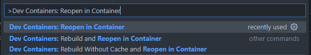
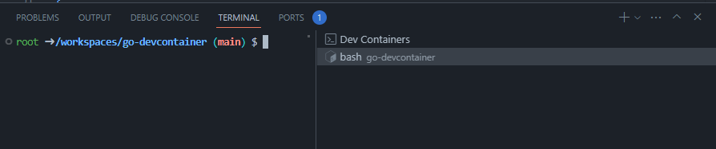

# Go Devcontaier

The Visual Studio Code Dev Containers extension lets you use a container as a full-featured development environment. It allows you to open any folder inside (or mounted into) a container and take advantage of Visual Studio Code's full feature set. A devcontainer.json file in your project tells VS Code how to access (or create) a development container with a well-defined tool and runtime stack. This container can be used to run an application or to separate tools, libraries, or runtimes needed for working with a codebase.

Workspace files are mounted from the local file system or copied or cloned into the container. Extensions are installed and run inside the container, where they have full access to the tools, platform, and file system. This means that you can seamlessly switch your entire development environment just by connecting to a different container.


Read more on https://code.visualstudio.com/docs/devcontainers/containers

- [Requirements](#requirements)
- [Starting](#starting)
- [Developing](#developing)
- [Testing](#testing)
- [References](#references)

## Requirements

- Docker installed locally.
- Docker installed on a remote environment.
- Visual Studio Code with [Devcontainer extension](https://marketplace.visualstudio.com/items?itemName=ms-vscode-remote.remote-containers)

## Starting

- Press F1 or Ctrl+Shift+P to open the Command Palette
- Type 'Dev Containers: Reopen in Container' and select the corresponding option from the list.

This will initiate the process of loading your application setup within a Docker container. You can then access your development environment seamlessly."



After running the 'Dev Containers: Reopen in Container' command, Visual Studio Code will open a new window with your project loaded inside a Docker container. Once the container has been successfully built, you can access your development environment, including the container terminal:



## Developing

Before you start developing, ensure that you have installed the necessary environment for the live-reload feature. Keep the container terminal open

To get CompileDaemon

```
make get-daemon
```

To install CompileDaemon

```
make install-daemon
```

To start a server

```
make serve
```

## References

- [CompileDaemon](https://github.com/githubnemo/CompileDaemon)
- [Visual Studio Code](https://code.visualstudio.com/docs)
- [Dev Container](https://code.visualstudio.com/docs/devcontainers/containers)
- [Docker](https://docs.docker.com/)
